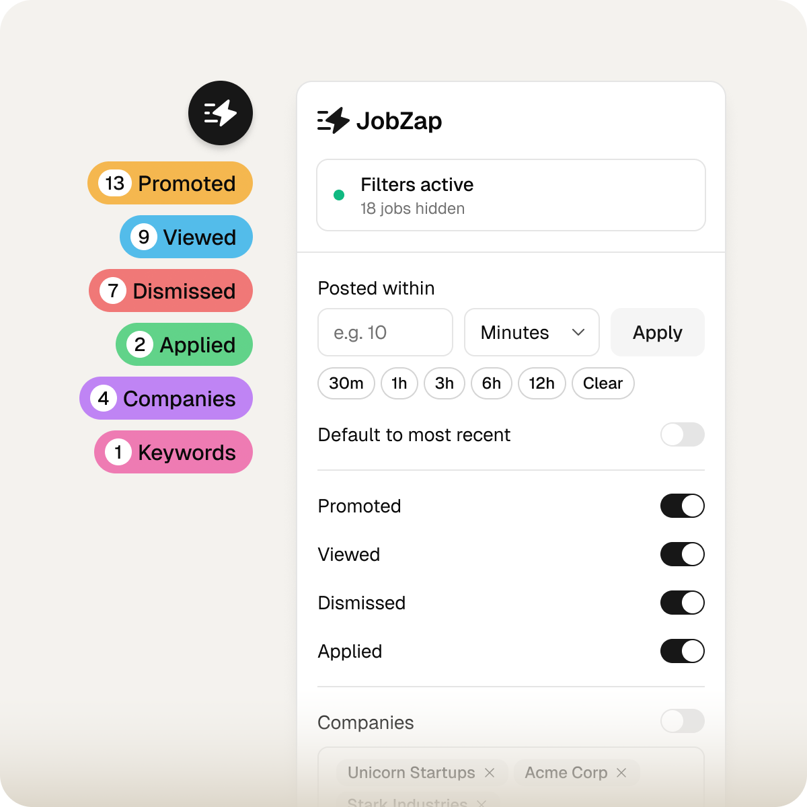

<p align="center">
  <picture>
    <source media="(prefers-color-scheme: dark)" srcset=".github/assets/logo-light.svg" />
    <source media="(prefers-color-scheme: light)" srcset=".github/assets/logo-dark.svg" />
    
  </picture>
</p>

<p align="center">Cut the noise from LinkedIn job search.</p>
<p align="center">Chrome extension that filters out irrelevant LinkedIn jobs and keeps your search focused.</p>

<p align="center">
  <a href="https://chromewebstore.google.com/detail/hbegbmijckoknpbcdmglobgegmeoinib"></a>
  <a href="../../releases"></a>
  <a href="./LICENSE"></a>
</p>

<p align="center">
 <a href="https://jobzap.app">
  
  </a>
</p>

---

## Features

### Hide irrelevant jobs

Hide jobs matching any combination of:

- Promoted
- Viewed
- Applied
- Dismissed
- Specific companies
- Title keywords

### Control search results

- Filter by any date range (e.g. last 3 days)
- Default to most recent sort (classic search only)

### Review jobs faster

- Highlight words and phrases in job descriptions

### Real-time feedback

- Floating pills show how many jobs are hidden
- Toggle filters on/off instantly while browsing

You can also export and import your settings to keep a backup or move between browsers. The export is plain JSON, so you can ask an AI assistant to make changes based on your preferences, then import it back.

## Installation

**[Install from Chrome Web Store](https://chromewebstore.google.com/detail/hbegbmijckoknpbcdmglobgegmeoinib)**

<details>
<summary>Manual install</summary>

1. Download the latest release from [Releases](../../releases)
2. Unzip the file
3. Open `chrome://extensions/`
4. Enable **Developer mode**
5. Click **Load unpacked** and select the unzipped folder

</details>

<details>
<summary>Build from source</summary>

```bash
git clone https://github.com/its-monotype/jobzap.git
cd jobzap
pnpm install
pnpm build
```

Then load `.output/chrome-mv3` in `chrome://extensions/` using **Load unpacked**.

</details>

## License

[AGPL-3.0](./LICENSE)
